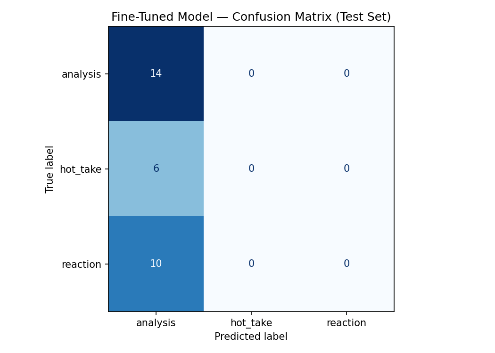

# TakeMeter: Football Discussion Classifier

This project classifies football discussion comments into one of three discourse categories:

- analysis
- hot_take
- reaction

The goal is to distinguish thoughtful football reasoning from unsupported opinions and emotional reactions using a fine-tuned DistilBERT model.

Community:
r/soccer and football discussion threads.

Model:
distilbert-base-uncased

Dataset Size:
200 labeled football comments.


## Labels

### Analysis
A comment that supports its opinion with football knowledge, tactical reasoning, statistics, historical context, or specific examples.

### Hot Take
A strong or controversial football opinion that is asserted confidently but lacks sufficient reasoning or evidence.

### Reaction
An emotional, humorous, celebratory, or frustrated response that does not attempt to make a substantive argument.

## Dataset

The dataset contains 200 manually labeled football discussion comments collected from public football discussion communities.

Label Distribution:

| Label | Count |
|---------|---------:|
| Analysis | 89 |
| Hot Take | 68 |
| Reaction | 43 |

The dataset was split automatically by the notebook:

- Training: 70%
- Validation: 15%
- Test: 15%

## Difficult Annotation Cases

### Example 1

**Comment:**
> Germany had lower possession than Switzerland or Turkey in their respective games.

**Why It's Tricky:**
This comment only states a statistic and does not provide an explicit argument or conclusion. It could be interpreted as a neutral observation rather than analysis.

**Possible Labels:**
- analysis
- reaction

**Final Label:**
`analysis`

**Reasoning:**
Although the comment does not explicitly explain the significance of the statistic, it contributes factual football information and encourages analytical discussion. It is more substantive than an emotional reaction and therefore fits best under analysis.

---

### Example 2

**Comment:**
> Great start for Morocco... they're playing some beautiful football.

**Why It's Tricky:**
The comment references the quality of play, which could appear analytical at first glance. However, it does not explain why Morocco is playing well or provide any football reasoning.

**Possible Labels:**
- analysis
- reaction

**Final Label:**
`reaction`

**Reasoning:**
The comment primarily expresses admiration and excitement about the team's performance. Since it lacks explanation, evidence, or tactical reasoning, it is classified as a reaction.

---

### Example 3

**Comment:**
> Vini was the only Brazilian who looked like an athlete.

**Why It's Tricky:**
The comment criticizes the overall Brazilian team and could be interpreted as an observation about player performance. However, it provides no evidence or explanation to support the claim.

**Possible Labels:**
- hot_take
- reaction

**Final Label:**
`hot_take`

**Reasoning:**
The comment makes a strong judgment about the players without providing reasoning or supporting evidence. Because it is a broad evaluative claim rather than an emotional reaction to a specific moment, it is classified as a hot take.


## Fine-Tuning Setup

Base Model:
distilbert-base-uncased

Hyperparameters:

- Epochs: 3
- Learning Rate: 2e-5
- Batch Size: 16
- Weight Decay: 0.01
- Warmup Steps: 50

The default notebook hyperparameters were used because the dataset contained only 200 examples and the defaults are commonly recommended for small BERT-style classification tasks.


## Fine-Tuning Approach

I fine-tuned `distilbert-base-uncased`, a pre-trained transformer model from Hugging Face, for a three-class text classification task. The model was trained to classify football comments into `analysis`, `hot_take`, or `reaction`.

The dataset was split automatically by the starter notebook into 70% training, 15% validation, and 15% test data. I used the training split to fine-tune the model and the validation split to monitor performance during training. The final evaluation was done on the locked test set.

### Training Setup

- Base model: `distilbert-base-uncased`
- Number of labels: 3
- Epochs: 3
- Learning rate: `2e-5`
- Training batch size: 16
- Evaluation batch size: 32
- Weight decay: 0.01
- Warmup steps: 50

### Hyperparameter Decision

I kept the number of training epochs at 3 because the dataset was small, with only about 200 examples. Training for many more epochs could cause the model to overfit to the training comments instead of learning general label patterns. I also kept the learning rate at `2e-5` because it is a standard starting point for fine-tuning BERT-style models and is stable for small classification datasets.


## Baseline Description

To establish a baseline, I used the Groq API with the `llama-3.3-70b-versatile` model in a zero-shot classification setting. The model was not given any examples from my dataset and received only the label definitions and classification instructions.

### Baseline Prompt

```text
You are classifying football discussion comments into exactly one discourse label.

Labels:

analysis:
A comment that supports its opinion with football knowledge, tactical reasoning, statistics, historical context, or specific examples.

hot_take:
A strong or controversial football opinion that is asserted confidently but lacks sufficient reasoning or evidence.

reaction:
An emotional, humorous, celebratory, or frustrated response that does not attempt to make a substantive argument.

Decision rules:
- If the comment provides football reasoning, tactics, statistics, or evidence, label it analysis.
- If the comment makes a broad or controversial claim without meaningful support, label it hot_take.
- If the comment mainly expresses emotion, humor, praise, frustration, or an immediate response, label it reaction.

Return only one label from this list:
analysis
hot_take
reaction

Comment:
{text}
```

### How Results Were Collected

The baseline was evaluated on the same held-out test set used for the fine-tuned model. For each test example, the Groq model was prompted with the comment text and asked to return exactly one label. The notebook then compared the predicted label against the ground-truth label and computed overall accuracy, precision, recall, and F1 scores for each class.

Using the same test set for both the baseline and the fine-tuned model ensured that the comparison was fair and that any performance differences reflected the models themselves rather than differences in evaluation data.


## Groq Zero-Shot Baseline

Accuracy: 53.3%

| Label | Precision | Recall | F1 |
|---------|---------:|---------:|---------:|
| Analysis | 1.00 | 0.29 | 0.44 |
| Hot Take | 0.30 | 0.50 | 0.38 |
| Reaction | 0.56 | 0.90 | 0.69 |

Macro F1: 0.50

## Fine-Tuned DistilBERT

Accuracy: 46.7%

| Label | Precision | Recall | F1 |
|---------|---------:|---------:|---------:|
| Analysis | 0.47 | 1.00 | 0.64 |
| Hot Take | 0.00 | 0.00 | 0.00 |
| Reaction | 0.00 | 0.00 | 0.00 |

Macro F1: 0.21

## Confusion Matrix (Fine-Tuned Model)

| True \ Predicted | Analysis | Hot Take | Reaction |
|------------------|----------|----------|----------|
| Analysis | 14 | 0 | 0 |
| Hot Take | 6 | 0 | 0 |
| Reaction | 10 | 0 | 0 |





## Sample Classifications

| Comment | Predicted Label | Confidence |
|----------|----------|----------:|
| The reason Liverpool has fallen off this hard is because Nunez needs 15 big chances before he scores. If he converted half his chances he'd score 40 a season and you cant win with a striker like that. | analysis | 0.38 |
| Lionel Messi is the oldest player to score a hat-trick at a World Cup game. He is also now tied with Miroslav Klose as the joint-top goalscorer of all time at 16 goals at the FIFA World Cup. | analysis | 0.39 |
| Morocco really just seemed to lack quality in the final third. Cunha should start for Brazil imo. | analysis | 0.39 |
| Messi is still the best. | analysis | 0.38 |
| Tunisia got wrecked. Well done Japan. | analysis | 0.40 |
| Ferran please stay on the bench for the rest of the tournament. | analysis | 0.39 |
| Portugal look downright horrible, I don't see them going far. Not even going to address the elephant in the room, Father Time is undefeated. | analysis | 0.39 |

### Correct Prediction Example 1

**Comment:**
> The reason Liverpool has fallen off this hard is because Nunez needs 15 big chances before he scores. If he converted half his chances he'd score 40 a season and you cant win with a striker like that.

**Prediction:** analysis (0.38)

This prediction is reasonable because the comment provides a cause-and-effect explanation for Liverpool's struggles and supports the claim with football-specific reasoning. The structure matches the project's definition of analysis.

---

### Correct Prediction Example 2

**Comment:**
> Morocco really just seemed to lack quality in the final third. Cunha should start for Brazil imo.

**Prediction:** analysis (0.39)

This prediction is reasonable because the comment discusses a team's performance and provides a football-related explanation. It goes beyond expressing emotion and attempts to evaluate play on the field.

---

### Incorrect Prediction Example 1

**Comment:**
> Messi is still the best.

**True Label:** hot_take

**Prediction:** analysis (0.38)

This prediction is incorrect because the comment is simply an unsupported opinion. It contains no evidence or reasoning and therefore should be classified as a hot_take.

---

### Incorrect Prediction Example 2

**Comment:**
> Tunisia got wrecked. Well done Japan.

**True Label:** reaction

**Prediction:** analysis (0.40)

This comment is primarily an emotional reaction to a match result. It contains no tactical reasoning or supporting evidence. The model incorrectly classified it as analysis.

---

### Incorrect Prediction Example 3

**Comment:**
> Ferran please stay on the bench for the rest of the tournament.

**True Label:** hot_take

**Prediction:** analysis (0.39)

This comment expresses a strong opinion about a player without any explanation or evidence. The model failed to distinguish an unsupported opinion from genuine football analysis.


## Failure Analysis

### Failure 1

**Comment:**
> Messi is still the best.

**True Label:** hot_take  
**Predicted Label:** analysis

**Why It Failed:**
This comment expresses a strong football opinion without providing any evidence or reasoning. According to the project definitions, it should be classified as a hot_take. However, the model predicted analysis, suggesting that it struggled to distinguish unsupported opinions from genuine football reasoning. The model appears to associate player discussion with analysis even when no explanation is present.

---

### Failure 2

**Comment:**
> Tunisia got wrecked. Well done Japan.

**True Label:** reaction  
**Predicted Label:** analysis

**Why It Failed:**
This comment is an emotional response to a match result and does not contain any tactical explanation or argument. The model incorrectly labeled it as analysis, indicating that it often failed to recognize simple celebratory or reactive comments.

---

### Failure 3

**Comment:**
> Portugal look downright horrible, I don't see them going far. Not even going to address the elephant in the room, Father Time is undefeated.

**True Label:** hot_take  
**Predicted Label:** analysis

**Why It Failed:**
The comment makes a strong prediction about Portugal's future performance without supporting evidence. While it references football topics, it does not provide tactical reasoning or analysis. The model appears to focus on football-related language rather than the presence or absence of evidence.


## Error Pattern Analysis

I used Claude to review the model's misclassified examples and identify recurring patterns. Claude suggested that the model was not distinguishing between discourse styles and instead relied heavily on the fact that a comment was about football.

After manually reviewing all 16 incorrect predictions, I found a very clear pattern: every incorrect prediction was classified as analysis.

Examples include:

- "Messi is still the best." (hot_take → analysis)
- "Tunisia got wrecked. Well done Japan." (reaction → analysis)
- "Ferran please stay on the bench for the rest of the tournament." (hot_take → analysis)
- "Its nice to see Japan today." (reaction → analysis)

This pattern suggests that the model collapsed toward predicting analysis regardless of the actual discourse type.

The confidence scores support this conclusion. Most incorrect predictions were assigned confidence values between 0.38 and 0.40, indicating that the model was not strongly confident but still consistently preferred the analysis label.

The confusion matrix further confirms this issue. The model correctly identified all analysis examples but failed to correctly classify any hot_take or reaction examples. As a result:

- Analysis Recall = 1.00
- Hot Take Recall = 0.00
- Reaction Recall = 0.00

This indicates that the model learned football-related vocabulary and topics but failed to learn the intended distinction between reasoning, unsupported opinions, and emotional reactions.

Several factors may have contributed to this behavior:

1. The dataset was relatively small (200 examples), limiting the model's ability to learn subtle discourse distinctions.
2. Many football comments are short and contain limited context, making label boundaries difficult to learn.
3. Analysis comments may have contained more football-specific terminology, causing the model to associate football discussion generally with the analysis label.
4. The training split may not have provided enough diverse examples of hot_take and reaction comments.

To improve performance, I would collect more examples of hot_take and reaction comments, especially short comments that closely resemble analysis in topic but differ in argumentative structure. I would also consider expanding the dataset beyond 200 examples to provide the model with more examples of difficult boundary cases.


## Reflection

My goal was for the model to learn the distinction between three different types of football discourse: analysis, hot_take, and reaction. Analysis comments provide reasoning, evidence, or football-specific explanations, hot_take comments make strong unsupported claims, and reaction comments primarily express emotion or immediate responses.

The final model did not learn these distinctions as well as I intended. Instead, it learned to strongly favor the analysis label. The confusion matrix showed that the model correctly identified analysis comments but failed to correctly classify any hot_take or reaction examples. Many comments that contained football opinions or emotional reactions were still predicted as analysis.

One likely explanation is that the model learned football-related vocabulary rather than discourse structure. Many analysis comments contained player names, teams, statistics, and tactical language. Because hot_take and reaction comments often discuss the same topics, the model appears to have associated football discussion itself with the analysis label. The relatively small dataset of 200 examples may also have limited the model's ability to learn subtle distinctions between the labels.

An interesting outcome was that the zero-shot Groq baseline outperformed the fine-tuned DistilBERT model. This suggests that the general-purpose language model already possessed a stronger understanding of discourse style than the fine-tuned model was able to learn from my dataset. While the fine-tuning process did not improve performance, it provided valuable insight into how difficult subjective discourse classification can be and how important dataset quality and label consistency are to successful model training.


## Spec Reflection

The project specification was particularly helpful during the planning phase. Defining labels, edge cases, and annotation rules before collecting data forced me to think carefully about the differences between analysis, hot_take, and reaction comments. This made the annotation process much more consistent and helped me identify difficult cases early.

One way my implementation diverged from the expectations in the spec was the final model performance. My original definition of success assumed that fine-tuning would outperform the zero-shot baseline. Instead, the fine-tuned DistilBERT model achieved lower accuracy and collapsed toward predicting a single label. This revealed that the task was more challenging than I initially expected and that additional data, improved label balance, or more explicit examples of difficult boundary cases would likely be needed to achieve the intended performance.


## AI Usage

### Label Stress Testing

I used Claude before annotation to test my label definitions and edge case rules. I provided the definitions for analysis, hot_take, and reaction and asked Claude to generate football comments that sat near the boundaries between labels. This helped me refine my decision rules before labeling the dataset.

---

### Annotation Assistance

I used Claude to assist with labeling football comments. I provided my label definitions and batches of unlabeled comments, and Claude suggested a label for each comment.

These labels were used only as initial recommendations. I manually reviewed every example, checked it against my annotation guidelines, and made the final labeling decision myself. When I disagreed with Claude's suggestion, I corrected the label based on the definitions established in planning.md.

Using Claude significantly reduced the time required for annotation while still allowing me to maintain consistency and quality control over the final dataset.

---

### Failure Analysis

After evaluating the fine-tuned model, I used Claude to analyze misclassified examples and identify recurring error patterns. Claude suggested that the model was relying heavily on football-related vocabulary and frequently defaulting to the analysis label.

I manually reviewed the incorrect predictions and confirmed this pattern by examining the confusion matrix and individual prediction examples before including the findings in my evaluation report.


## Conclusion

This project explored discourse classification in football discussions using three labels: analysis, hot_take, and reaction.

The Groq zero-shot baseline achieved 53.3% accuracy, while the fine-tuned DistilBERT model achieved 46.7% accuracy. Although fine-tuning did not outperform the baseline, the project revealed that distinguishing between football reasoning, unsupported opinions, and emotional reactions is a challenging task with a relatively small dataset.

The results suggest that larger datasets, additional examples of difficult edge cases, and improved class balance would likely improve future performance.

Another contributing factor may have been class imbalance. Analysis comments appeared more frequently in the dataset than reaction comments, which may have encouraged the model to favor the analysis label during training.

